<div align="center">

</div>

<br/>

<div align="center">

[](https://git.io/typing-svg)

</div>

<br/>

---

## `$ whoami`

```json
{
  "name"     : "Syamsuardi",
  "location" : "Makassar, Indonesia 🇮🇩",
  "campus"   : "UIN Alauddin Makassar",
  "major"    : "Information Systems",
  "role"     : ["Backend Developer", "Frontend Developer"],
  "status"   : "Open to collaborate ✦"
}
```

<br/>

---

## `$ ls skills/`

<table>
<tr>
<td valign="top" width="25%">

**Languages**
```
▸ PHP
▸ Python
▸ Java
▸ JavaScript
▸ HTML / CSS
▸ API Design
```

</td>
<td valign="top" width="25%">

**Frameworks**
```
▸ Laravel
▸ React
▸ Express
▸ Node.js
```

</td>
<td valign="top" width="25%">

**Databases**
```
▸ MySQL
▸ PostgreSQL
```

</td>
<td valign="top" width="25%">

**Tools**
```
▸ VS Code
▸ Postman
▸ Git / GitHub
▸ Laragon
▸ Antigravity
```

</td>
</tr>
</table>

<br/>

---

## `$ cat stats.json`

<div align="center">


&nbsp;&nbsp;


<br/><br/>


</div>

<br/>

---

## `$ cat activity.log`

<div align="center">

</div>

<br/>

---

## `$ git log --oneline trophies`

<div align="center">

</div>

<br/>

---

## `$ open contacts/`

<div align="center">

<a href="https://www.instagram.com/szs_samm28/">

</a>
&nbsp;
<a href="https://www.linkedin.com/in/syam-suardi-a625412a9/">

</a>
&nbsp;
<a href="mailto:syam79485@gmail.com">

</a>

<br/><br/>


</div>

<br/>

---

<div align="center">
<sub><code>// Makassar, South Sulawesi · Indonesia · 2025</code></sub>
</div>
