<!-- BANNER - Letakkan file banner.svg di root repo kamu, lalu gunakan kode ini: -->
<div align="center">

</div>

<!-- Jika ingin host di GitHub langsung (setelah upload banner.svg ke repo): -->
<!--  -->

---

<!-- Typing SVG -->
<div align="center">
<a href="https://git.io/typing-svg">
  
</a>


&nbsp;
<a href="https://github.com/Syamsuardi28?tab=followers">
  
</a>
</div>

---


## 👨‍💻 About Me

```typescript
const syamsuardi = {
  name     : "Syamsuardi",
  alias    : "szs_samm28",
  location : "Makassar, Indonesia 🇮🇩",
  edu      : {
    campus : "UIN Alauddin Makassar",
    major  : "Information Systems",
  },
  role      : "Backend Developer",
  focus     : ["REST APIs", "Database Design", "System Architecture"],
  currently : "Building something awesome 🔨",
  funFact   : "I debug at midnight and ship at dawn 🌙",
};
```

<br clear="right"/>

---

## 🛠️ Tech Stack

<div align="center">

### ⚡ Languages
<p>

</p>

### 🚀 Frameworks & Runtime
<p>

</p>

### 🗄️ Databases & Storage
<p>

</p>

### 🔧 Tools & DevOps
<p>

</p>

</div>

---

## 📊 GitHub Stats

<div align="center">


</div>

---

## 🏆 GitHub Trophies

<div align="center">

</div>

---

## 📈 Contribution Graph

<div align="center">

</div>

---

## 💡 Dev Quote of the Day

<div align="center">


</div>

---

## 🤝 Connect With Me

<div align="center">

<a href="https://www.instagram.com/szs_samm28/">
  
</a>
&nbsp;
<a href="https://www.linkedin.com/in/syam-suardi-a625412a9/">
  
</a>
&nbsp;
<a href="mailto:syam79485@gmail.com">
  
</a>

<br/><br/>

**📍 Makassar, South Sulawesi, Indonesia**

<br/>


</div>

---

<div align="center">

</div><div align="center">

<!-- Animated Header -->


<!-- Typing SVG -->
<a href="https://git.io/typing-svg">
  
</a>

<br/>

<!-- Profile Views & Socials Badges -->

&nbsp;
<a href="https://github.com/Syamsuardi28?tab=followers">
  
</a>

</div>

---


## 👨‍💻 About Me

```typescript
const syamsuardi = {
  name     : "Syamsuardi",
  alias    : "szs_samm28",
  location : "Makassar, Indonesia 🇮🇩",
  edu      : {
    campus : "UIN Alauddin Makassar",
    major  : "Information Systems",
  },
  role      : "Backend Developer",
  focus     : ["REST APIs", "Database Design", "System Architecture"],
  currently : "Building something awesome 🔨",
  funFact   : "I debug at midnight and ship at dawn 🌙",
};
```

<br clear="right"/>

---

## 🛠️ Tech Stack

<div align="center">

### ⚡ Languages
<p>

</p>

### 🚀 Frameworks & Runtime
<p>

</p>

### 🗄️ Databases & Storage
<p>

</p>

### 🔧 Tools & DevOps
<p>

</p>

</div>

---

## 📊 GitHub Stats

<div align="center">


</div>

---

## 🏆 GitHub Trophies

<div align="center">

</div>

---

## 📈 Contribution Graph

<div align="center">

</div>

---

## 💡 Dev Quote of the Day

<div align="center">


</div>

---

## 🤝 Connect With Me

<div align="center">


<br/><br/>

<a href="https://www.instagram.com/szs_samm28/">
  
</a>
&nbsp;
<a href="https://www.linkedin.com/in/syam-suardi-a625412a9/">
  
</a>
&nbsp;
<a href="mailto:syam79485@gmail.com">
  
</a>

<br/><br/>

**📍 Makassar, South Sulawesi, Indonesia**

<br/>

> *"First, solve the problem. Then, write the code."* — John Johnson

</div>

---

<div align="center">

### 💼 Open for collaborations & exciting opportunities!


<br/><br/>


</div>
